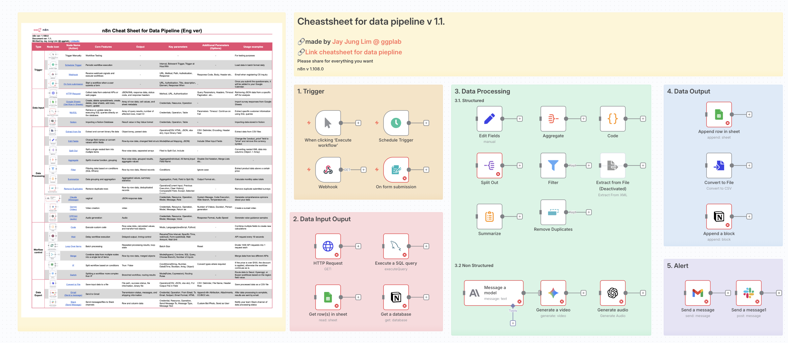
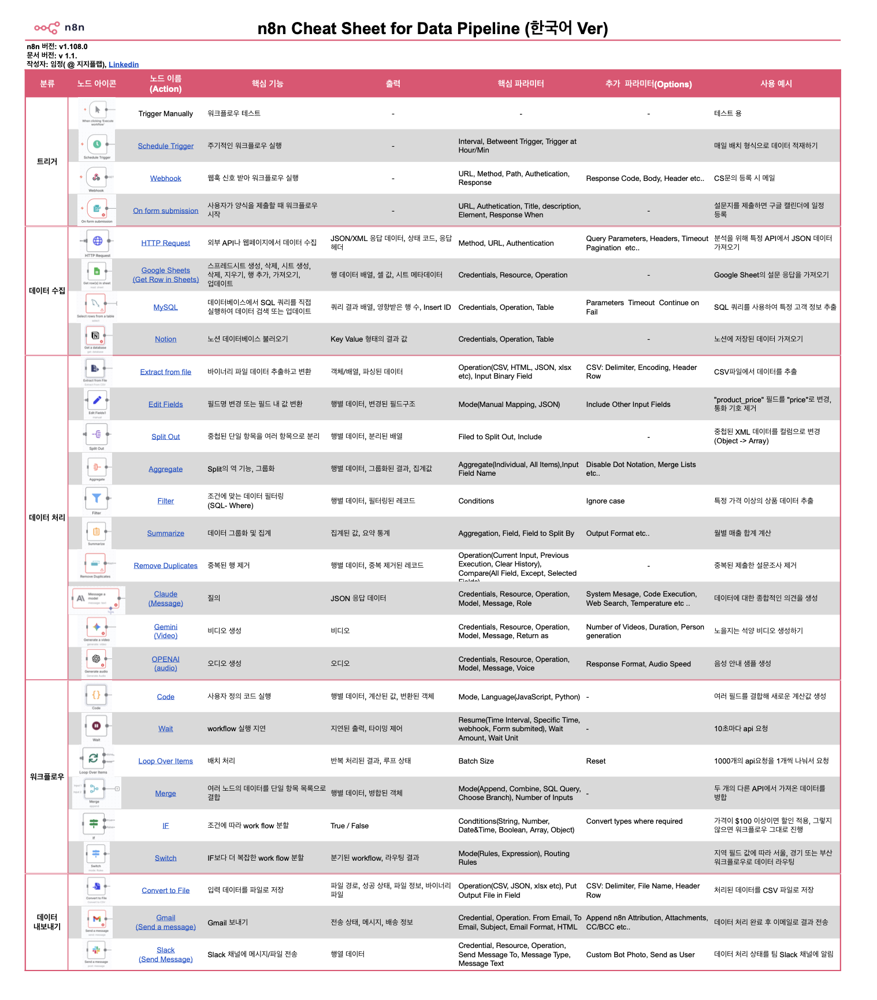
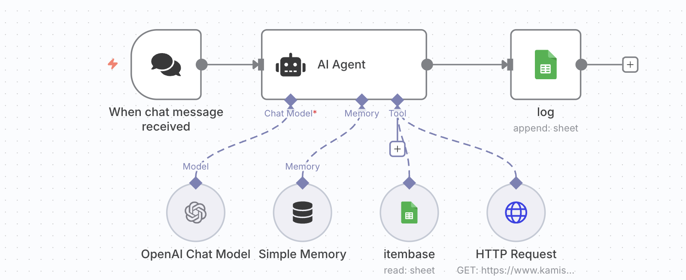
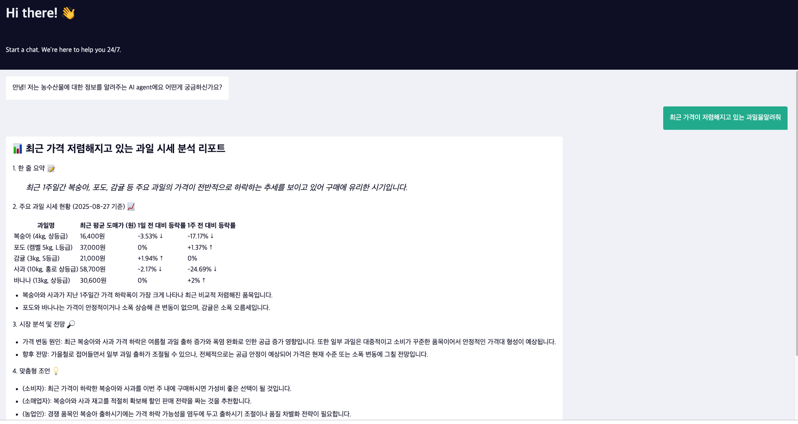

# n8n template
#n8n #DataPipeline #Automation #NoCode #DataAnalysis

## Introduction
> **실무에서 바로 사용할 수 있는 n8n 워크플로우와 치트시트 모음**  
> 데이터 분석부터 AI 에이전트까지, 검증된 워크플로우를 공유합니다.

## Directory

- [cheatsheets](./cheatsheet/): 데이터 파이프라인을 위한 치트시트 디렉토리
- [workflows_kamis](./workflow_FarmData): 농수산물 api(kamis api)를 이용한 장보기를 돕는 AI Agent 디렉토리

## Summary

### n8n_cheatsheet_for_data_pipeline

- [Google Sheets for Eng](https://docs.google.com/spreadsheets/d/1enboErLA1upWs4NEI7EjbCz9oOJgIVG7BkOU_Ffz990/edit?gid=1162658664#gid=1162658664)
- [Google Sheets for Kor](https://docs.google.com/spreadsheets/d/1enboErLA1upWs4NEI7EjbCz9oOJgIVG7BkOU_Ffz990/edit?usp=sharing)

### [유즈케이스] FarmData
[🔗 팜데이터 AI Agent 사용하기](https://ggplot.app.n8n.cloud/webhook/829e88d2-6a2c-49b2-9dda-67642b69fe67/chat)

(**주의**: PoC이기 때문에 언제든지 내려갈 수 있습니다 )

## 작성자
made by 지지플랏(임정) @ 지지플랩, [✉️ Linkedin](https://www.linkedin.com/in/jayjunglim/), [📝 블로그](https://snowgot.tistory.com)