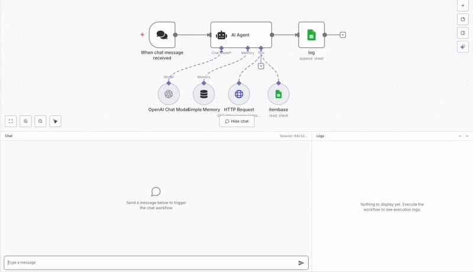

# 🌾 FarmData (팜데이터)

> **농산물 시세 전문 분석가 AI 챗봇**  
> 실시간 농산물 가격 데이터를 기반으로 한 똑똑한 시장 분석과 맞춤형 구매/판매 조언

[🔗 팜데이터 AI Agent 사용하기 🛜](https://ggplot.app.n8n.cloud/webhook/829e88d2-6a2c-49b2-9dda-67642b69fe67/chat)

(**주의**: PoC이기 때문에 언제든지 내려갈 수 있습니다 )

- n8n 화면



- 실제 접속 화면


## 📋 1. 목차
- 개요
- 주요 기능
- 시스템 아키텍처
- API 연동
- 사용 예시

## 🎯 2. 개요

 [KAMIS(농수산물 유통정보) API](https://www.kamis.or.kr/customer/reference/openapi_list.do)와 Google Sheets 데이터베이스를 결합하여, 복잡한 농산물 시세 데이터를 사용자 친화적인 인사이트로 변환하는 AI Agent입니다. 또한, 단순한 가격 조회를 넘어서, 시장 동향 분석, 가격 예측, 맞춤형 구매/판매 전략까지 제공하는 종합 농산물 시세 컨설팅 서비스입니다.

- ✨ 핵심 가치
  - 📊 **데이터 기반 분석**: 실시간 KAMIS API 데이터 활용
  - 🧠 **AI 인사이트**: 복잡한 시세 데이터를 이해하기 쉬운 조언으로 변환
  - 🎯 **맞춤형 조언**: 소비자, 소매업자, 농업인별 맞춤 전략 제공
  - 📈 **트렌드 분석**: 과거 데이터 기반 미래 가격 전망


## 🚀 3. 주요 기능

### 1. 실시간 시세 조회 및 분석
```
"오늘 사과 시세 어때?" → 실시간 가격 + 전일/전주/전월/평년 대비 분석
```
- 최신 도매가격 조회
- 다양한 기간 대비 변동률 분석
- 가격 변동 원인 해석

### 2. 가격 비교 분석
```
"사과랑 배 중에 뭐가 더 싸?" → 품목간 가격 비교 + 경제적 선택 조언
"서울이랑 부산 양파 가격 비교해줘" → 지역간 가격 차이 분석
```
- 품목간 가격 비교
- 지역별 시세 차이 분석
- 최적 구매 선택 가이드

### 3. 기간별 가격 추이 분석
```
"지난 3개월간 마늘 가격 변동 알려줘" → 시계열 트렌드 분석
```
- 특정 기간 가격 추이 시각화
- 계절성 패턴 분석
- 가격 변동 특징 해석

### 4. 시장 동향 요약 및 추천
```
"요즘 제철이면서 저렴한 과일 추천해줘" → 시기별 최적 품목 추천
```
- 제철 농산물 추천
- 가격 안정/하락 품목 발굴
- 시장 핫이슈 요약

### 5. 구매/판매 전략 조언
```
"김장 배추 언제 사는 게 좋을까?" → 타이밍 기반 전략 컨설팅
```
- **소비자**: 최적 구매 타이밍, 대체 품목 제안
- **소매업자**: 입고 계획, 가격 책정 조언  
- **농업인**: 출하 타이밍, 저장 전략

## 🏗️ 시스템 아키텍처


### 핵심 컴포넌트

1. **n8n AI Agent**: 대화 흐름 관리 및 AI 추론
2. **KAMIS API 연동**: 실시간 농산물 시세 데이터 수집
3. **Google Sheets DB**: 품목 코드 매핑 및 메타데이터 관리
4. **분석 엔진**: 시세 데이터 해석 및 인사이트 도출

## 🔌 4. API 연동

### KAMIS API
```bash
# 일별 시세 조회 예시
curl -X GET "http://www.kamis.or.kr/service/price/xml.do" \
  -G \
  -d "action=dailyPriceByCategoryList" \
  -d "p_product_cls_code=02" \
  -d "p_country_code=1101" \
  -d "p_regday=2024-08-28" \
  -d "p_cert_key=YOUR_API_KEY" \
  -d "p_cert_id=YOUR_API_ID"
```

### Google Sheets 연동
- **item_code**: 품목명 → 품목코드, 부류코드 매핑

## 💬 5. 사용 예시

### 기본 시세 조회
**입력:** "오늘 사과 시세 어때?"

**출력:**
```
📊 사과 시세 분석 리포트

1. 한 줄 요약 📝
> 현재 사과 가격은 평년 대비 8% 높은 수준이며, 최근 상승 추세입니다.

2. 실시간 시세 현황 📈
- 오늘 평균 도매가: 3,200원 / kg
- 전일 대비: +2.1% ▲
- 1주일 전 대비: -1.8% ▼
- 1개월 전 대비: +5.3% ▲
- 평년 동기 대비: +8.3% ▲

3. 시장 분석 및 전망 🔎
- 가격 변동 원인: 폭염으로 인한 품질 저하와 저장고 재고 부족
- 향후 전망: 추석 수요 증가로 2주간 추가 상승 예상

4. 맞춤형 조언 💡
- (소비자): 대량 구매보다는 필요한 만큼만, 배나 감 등 대체 품목 고려
- (소매업자): 주말 수요 대비 목요일 오전 입고 권장
- (농업인): 현재 좋은 출하 시기, 상품부터 우선 판매

5. 추가 정보 📌
- 품질 Tip: 껍질이 단단하고 향이 진한 것 선택
- 보관법: 신문지 포장 후 냉장고 야채칸 보관
```

## 6.n8n 사용 방법

1. n8n 클라우드 로그인(회원가입시 14일 무료)
2. FarmData(kamis_api).json파일 업로드(Import from file)
3. OPENAI API key 발급 및 Crendital 적용
4. item_base.csv 파일을 Google Drive 업로드, 워크플로우에서 itembase 노드로 설정
5. item_log.csv 파일을 Google Drive 업로드, 워크플로우에서 log 노드로 설정.