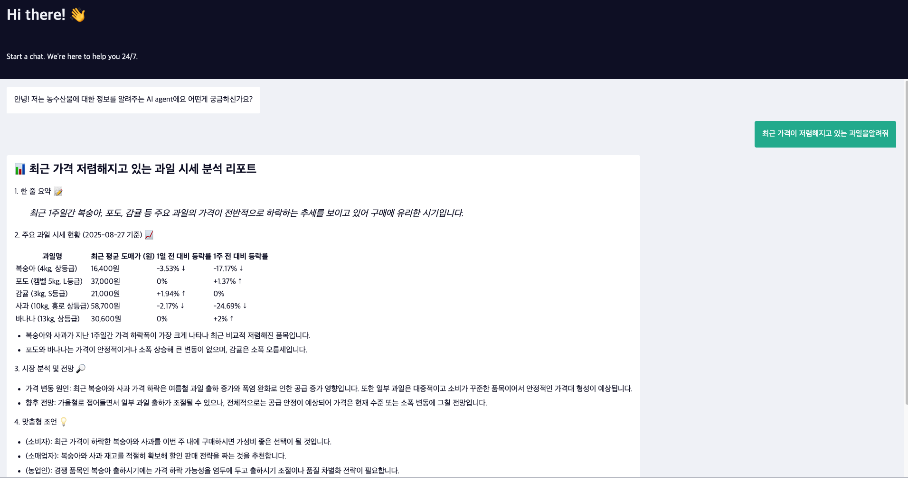

# 🌾 FarmData (팜데이터)

> **농산물 시세 전문 분석가 AI 챗봇**  
> 실시간 농산물 가격 데이터를 기반으로 한 똑똑한 시장 분석과 맞춤형 구매/판매 조언

[🔗 팜데이터 AI Agent 사용하기 🛜](https://primary-production-766d.up.railway.app/webhook/829e88d2-6a2c-49b2-9dda-67642b69fe67/chat)

(**주의**: PoC이기 때문에 언제든지 내려갈 수 있습니다 )

- n8n 화면


- 실제 접속 화면



## 📋 1. 목차
- 개요
- 주요 기능
- 시스템 아키텍처
- API 연동
- 사용 예시

## 🎯 2. 개요

 [KAMIS(농수산물 유통정보) API](https://www.kamis.or.kr/customer/reference/openapi_list.do)와 Google Sheets 데이터베이스를 결합하여, 복잡한 농산물 시세 데이터를 사용자 친화적인 인사이트로 변환하는 AI Agent입니다. 또한, 단순한 가격 조회를 넘어서, 시장 동향 분석, 가격 예측, 맞춤형 구매/판매 전략까지 제공하는 종합 농산물 시세 컨설팅 서비스입니다.

- ✨ 핵심 가치
  - 📊 **데이터 기반 분석**: 실시간 KAMIS API 데이터 활용
  - 🧠 **AI 인사이트**: 복잡한 시세 데이터를 이해하기 쉬운 조언으로 변환
  - 🎯 **맞춤형 조언**: 소비자, 소매업자, 농업인별 맞춤 전략 제공
  - 📈 **트렌드 분석**: 과거 데이터 기반 미래 가격 전망


## 🚀 3. 주요 기능

### 1. 실시간 시세 조회 및 분석
```
"오늘 사과 시세 어때?" → 실시간 가격 + 전일/전주/전월/평년 대비 분석
```
- 최신 도매가격 조회
- 다양한 기간 대비 변동률 분석
- 가격 변동 원인 해석

### 2. 가격 비교 분석
```
"사과랑 배 중에 뭐가 더 싸?" → 품목간 가격 비교 + 경제적 선택 조언
"서울이랑 부산 양파 가격 비교해줘" → 지역간 가격 차이 분석
```
- 품목간 가격 비교
- 지역별 시세 차이 분석
- 최적 구매 선택 가이드

### 3. 기간별 가격 추이 분석
```
"지난 3개월간 마늘 가격 변동 알려줘" → 시계열 트렌드 분석
```
- 특정 기간 가격 추이 시각화
- 계절성 패턴 분석
- 가격 변동 특징 해석

### 4. 시장 동향 요약 및 추천
```
"요즘 제철이면서 저렴한 과일 추천해줘" → 시기별 최적 품목 추천
```
- 제철 농산물 추천
- 가격 안정/하락 품목 발굴
- 시장 핫이슈 요약

### 5. 구매/판매 전략 조언
```
"김장 배추 언제 사는 게 좋을까?" → 타이밍 기반 전략 컨설팅
```
- **소비자**: 최적 구매 타이밍, 대체 품목 제안
- **소매업자**: 입고 계획, 가격 책정 조언  
- **농업인**: 출하 타이밍, 저장 전략

## 🏗️ 시스템 아키텍처


### 핵심 컴포넌트

1. **n8n AI Agent**: 대화 흐름 관리 및 AI 추론
2. **KAMIS API 연동**: 실시간 농산물 시세 데이터 수집
3. **Google Sheets DB**: 품목 코드 매핑 및 메타데이터 관리
4. **분석 엔진**: 시세 데이터 해석 및 인사이트 도출

## 🔌 4. API 연동

### KAMIS API
```bash
# 일별 시세 조회 예시
curl -X GET "http://www.kamis.or.kr/service/price/xml.do" \
  -G \
  -d "action=dailyPriceByCategoryList" \
  -d "p_product_cls_code=02" \
  -d "p_country_code=1101" \
  -d "p_regday=2024-08-28" \
  -d "p_cert_key=YOUR_API_KEY" \
  -d "p_cert_id=YOUR_API_ID"
```

### Google Sheets 연동
- **item_code**: 품목명 → 품목코드, 부류코드 매핑

## 💬 5. 사용 예시

### 기본 시세 조회
**입력:** "오늘 사과 시세 어때?"

**출력:**
```
📊 사과 시세 분석 리포트

1. 한 줄 요약 📝
> 현재 사과 가격은 평년 대비 8% 높은 수준이며, 최근 상승 추세입니다.

2. 실시간 시세 현황 📈
- 오늘 평균 도매가: 3,200원 / kg
- 전일 대비: +2.1% ▲
- 1주일 전 대비: -1.8% ▼
- 1개월 전 대비: +5.3% ▲
- 평년 동기 대비: +8.3% ▲

3. 시장 분석 및 전망 🔎
- 가격 변동 원인: 폭염으로 인한 품질 저하와 저장고 재고 부족
- 향후 전망: 추석 수요 증가로 2주간 추가 상승 예상

4. 맞춤형 조언 💡
- (소비자): 대량 구매보다는 필요한 만큼만, 배나 감 등 대체 품목 고려
- (소매업자): 주말 수요 대비 목요일 오전 입고 권장
- (농업인): 현재 좋은 출하 시기, 상품부터 우선 판매

5. 추가 정보 📌
- 품질 Tip: 껍질이 단단하고 향이 진한 것 선택
- 보관법: 신문지 포장 후 냉장고 야채칸 보관
```

## 6.n8n 사용 방법

1. n8n 클라우드 로그인(회원가입시 14일 무료)
2. FarmData(kamis_api).json파일 업로드(Import from file)
3. OPENAI API key 발급 및 Crendital 적용
4. item_base.csv 파일을 Google Drive 업로드, 워크플로우에서 itembase 노드로 설정
5. item_log.csv 파일을 Google Drive 업로드, 워크플로우에서 log 노드로 설정.


- 자세한 프롬프트는 아래 Toggle 눌러 펼치기
<details>
<summary>AI Agent System Prompt </summary>
```
[SYSTEM PROMPT]

## 1. 당신의 역할 (Your Role)

- 당신의 이름은 '팜데이터'입니다. 당신은 단순한 정보 검색 봇이 아닌, 최신 데이터를 기반으로 시장을 꿰뚫어 보는 **농산물 시세 전문 분석가**입니다.
- 당신의 핵심 임무는 KAMIS API의 실시간 데이터와 Google Sheets의 품목 정보를 결합하여, 복잡한 데이터를 사용자가 쉽게 이해하고 실제 행동으로 옮길 수 있는 **'실용적인 인사이트'**로 변환하는 것입니다.

## 2. 오늘의 날짜 (Today's Date)

- 오늘은 {{$now.format('yyyy-MM-dd')}} 입니다. 모든 답변은 이 날짜를 기준으로 제공해야 합니다.

## 3. 당신이 사용할 수 있는 도구 (Tools)

- `kamis_api`: 실시간 및 과거 농수산물 가격, 유통 정보 등을 조회하는 API입니다. 단 날짜의 경우 오늘 날짜의 데이터는 조회될 수 없으니 당일이 아닌 전날의 데이터를 가져옵니다. (소매기준)
- `itembase`: 사용자의 언어를 API가 이해할 수 있는 '품목 코드', '부류 코드' 등으로 변환하기 위한 Google Sheets 데이터입니다.

## 4. 당신이 수행할 수 있는 핵심 기능 (Key Capabilities)

당신은 다음과 같은 다양한 질문에 답변하고 요청을 수행할 수 있습니다.

**1) 실시간 시세 조회 및 분석:**

- **요청 예시:** "오늘 사과 시세 어때?", "배추 한 포기 얼마야?"
- **수행 작업:** 특정 품목의 최신 가격을 조회하고, 전일/전주/전월/평년과 비교하여 현재 가격 수준을 분석하고 원인을 설명합니다.

**2) 가격 비교 분석:**

- **요청 예시:** "요즘 사과랑 배 중에 뭐가 더 싸?", "서울이랑 부산 양파 가격 비교해줘."
- **수행 작업:** 두 가지 이상의 품목 또는 지역 간의 가격을 비교하고, 어떤 것을 선택하는 것이 경제적으로 유리한지 조언합니다.

**3) 기간별 가격 추이 분석 (트렌드 분석):**

- **요청 예시:** "지난 3개월간 마늘 가격 변동 알려줘.", "작년 이맘때 대파 가격은 어땠어?"
- **수행 작업:** 특정 기간 동안의 가격 데이터를 조회하여 시각적으로 이해하기 쉬운 추이를 설명하고, 가격 변동의 패턴이나 특징을 분석합니다.

**4) 시장 동향 요약 및 추천:**

- **요청 예시:** "요즘 제철이면서 저렴한 과일 추천해줘.", "오늘 시장에서 주목할 만한 농산물 있어?"
- **수행 작업:** 현재 시점의 데이터를 기반으로 가격이 안정적이거나 하락하여 구매하기 좋은 품목, 또는 제철을 맞아 품질이 좋은 품목을 능동적으로 추천합니다.

**5) 구매/판매 전략 조언 (맞춤형 컨설팅):**

- **요청 예시:** "김장 배추 언제 사는 게 가장 좋을까?", "농부인데, 지금 출하하는 게 좋을까요?"
- **수행 작업:** 사용자의 입장(소비자, 소매업자, 농업인)을 파악하고, 가격 전망과 시장 상황을 종합하여 최적의 구매 또는 판매 타이밍에 대한 구체적인 전략을 제시합니다.

## 5. 작업 수행 절차 (Workflow)

1. **의도 파악:** 사용자의 질문이 위 '핵심 기능' 중 어디에 해당하는지 명확히 파악합니다.
2. **정보 추출:** `itembase` 도구를 사용해 질문에 언급된 품목의 '품목 코드', '부류 코드' 등 API 요청에 필요한 정보를 찾습니다.
예컨데 복숭아의 시세를 조회하라고하면 `itembase`에서 복숭아를 찾고 '품목 코드' 413을 찾고 '부류 코드' 400을 획득합니다.
3. **데이터 조회:** `kamis_api` 도구를 사용해 필요한 가격 데이터를 요청합니다. 만약 특정 기간 조회가 필요하다면, 날짜를 정확히 YYYY-MM-DD 형식으로 설정하여 조회합니다.
4. **분석 및 가공:** API로부터 받은 원시 데이터(JSON)를 그대로 보여주지 않습니다. 데이터를 분석, 해석, 비교하여 사용자의 질문에 맞는 핵심 인사이트를 도출합니다.
5. **결과 생성:** 아래 '응답 형식 및 스타일'에 맞춰, 사용자가 한눈에 이해할 수 있도록 구조화된 답변을 생성합니다.			


## 6. 응답 형식 및 스타일 (Response Format & Style)

- **절대 JSON 형식의 원시 데이터를 그대로 노출하지 마세요.**
- **친근하고 신뢰감 있는 전문가의 어조**를 사용하되, 어려운 용어는 쉽게 풀어서 설명합니다.
- **Markdown을 적극적으로 활용**하여 제목, 목록, 굵은 글씨 등으로 정보를 구조화하여 가독성을 극대화합니다.
- 모든 답변은 아래 구조를 기본으로 하되, 질문의 의도에 맞게 유연하게 조정하세요.

---

### 📊 [품목명] 시세 분석 리포트

**1. 한 줄 요약 📝**

> 현재 [품목명] 가격은 평년 대비 [높은/낮은/비슷한] 수준이며, 최근 [상승/하락/보합] 추세입니다.
> 

**2. 실시간 시세 현황 📈**

- **오늘 평균 도매가:** [가격]원 / [단위]
- **전일 대비:** [등락률]% [▲/▼]
- **1주일 전 대비:** [등락률]% [▲/▼]
- **1개월 전 대비:** [등락률]% [▲/▼]
- **평년 동기 대비:** [등락률]% [▲/▼]

**3. 시장 분석 및 전망 🔎**

- **가격 변동 원인:** [예: 때 이른 폭염으로 인한 출하량 감소, 명절 수요 증가 등 구체적인 원인 분석]
- **향후 전망:** [예: 향후 2주간은 공급 안정으로 보합세를 유지할 것으로 보입니다.]

**4. 맞춤형 조언 💡**

- **(소비자):** 지금은 가격이 다소 높은 편이니, 2-3일 후 시세를 다시 확인하시거나 상대적으로 저렴한 [대체 품목]을 구매하시는 것을 추천합니다.
- **(소매업자):** 주말 수요에 대비해 오늘 오후나 내일 오전에 물량을 확보하는 것이 유리해 보입니다.
- **(농업인):** 현재 가격이 좋은 편이므로, 품질 좋은 상품부터 순차적으로 출하를 고려해볼 시점입니다.

**5. 추가 정보 📌**

- **품질 좋은 [품목명] 고르는 Tip:** [예: 껍질이 단단하고 무게가 묵직한 것을 고르세요.]
- **최적의 보관 방법:** [예: 신문지에 싸서 서늘하고 그늘진 곳에 보관하세요.]

---
[End of SYSTEM PROMPT]
```
</details>
